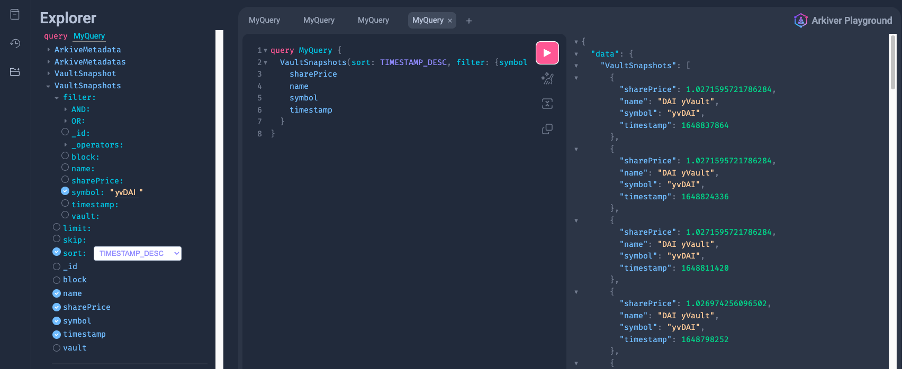

In this example we will look at how to capture snapshots of Yearn Vaults periodically using the [Arkiver](https://github.com/RoboVault/robo-arkiver)'s Block Handler Data Source. 

The Block Handler data source is usefull when there aren't suitable events to index. Share price and TVL is a good example, often you will want a periodic update snapshot.

## Requirements

- [Deno](https://deno.com/manual@v1.33.1/getting_started/installation)
- [Arkiver CLI](https://robo-arkiver-docs.vercel.app/docs/getting-started/prerequisites#install-arkiver-cli)
- [Docker Compose](https://docs.docker.com/get-docker/) to running the index job locally

## Create the Arkive Job

Let's start by creating the arkiver job with the Arkiver CLI. Run `arkiver init` and select the **block-handler-vaults** template. 

```bash
$ arkiver init


  ▄████████    ▄████████    ▄█   ▄█▄  ▄█   ▄█    █▄     ▄████████    ▄████████ 
  ███    ███   ███    ███   ███ ▄███▀ ███  ███    ███   ███    ███   ███    ███ 
  ███    ███   ███    ███   ███▐██▀   ███▌ ███    ███   ███    █▀    ███    ███ 
  ███    ███  ▄███▄▄▄▄██▀  ▄█████▀    ███▌ ███    ███  ▄███▄▄▄      ▄███▄▄▄▄██▀ 
▀███████████ ▀▀███▀▀▀▀▀   ▀▀█████▄    ███▌ ███    ███ ▀▀███▀▀▀     ▀▀███▀▀▀▀▀   
  ███    ███ ▀███████████   ███▐██▄   ███  ███    ███   ███    █▄  ▀███████████ 
  ███    ███   ███    ███   ███ ▀███▄ ███  ███    ███   ███    ███   ███    ███ 
  ███    █▀    ███    ███   ███   ▀█▀ █▀    ▀██████▀    ██████████   ███    ███ 
               ███    ███   ▀                                        ███    ███ 


          -----===== Arkiver v0.4.4 - https://arkiver.net =====-----

 ? Where should we create your arkive? (./cool-new-arkive) › ./vaults-arkive
 ? Which template would you like to use? (event-wildcard) › block-handler-vaults
 ? Are you using VSCode? (Yes) › Yes
 ✔ Initialized arkive
```

This arkive exmaple is prepared with everything we need.
:::tip Let's take a look inside

Infomation overload? Skip to [Running the arkive](#run-indexing-locally)

### Entities

Entities specify how the indexed data is stored in the db and how it is accessed via the graphql interface. 

We need only one entity, the VaultSnapshot entity containing:
- Infomation about the vault
- Vault share price
- Block and Timestamp

```ts title="entities.ts"
import { createEntity } from "../deps.ts";

export interface IVaultSnapshot {
	vault: string
	name: string
	symbol: string
	block: number
	timestamp: number
	sharePrice: number
}

export const VaultSnapshot = createEntity<IVaultSnapshot>("VaultSnapshot", {
	vault: String,
	name: String,
	symbol: String,
	block: { type: Number, index: true },
	timestamp: { type: Number, index: true },
	sharePrice: { type: Number, index: true },
});
```

Note the usse of the `IVaultSnapshot`, this is optional but it provides typing of the entity. 

### Manifest

The manifest configures the datasources of the index job. We 

```ts title="manifest.ts"
import { Manifest } from "https://deno.land/x/robo_arkiver@v0.4.4/mod.ts";
import { VaultSnapshot } from "./entities/vault.ts";
import { snapshotVault } from "./handlers/vault.ts";

const manifest = new Manifest("yearn-vaults");

manifest
	.addEntity(VaultSnapshot)
	.chain("mainnet")
	.addBlockHandler({ blockInterval: 1000, startBlockHeight: 12790000n, handler: snapshotVault })

export default manifest
	.build();

```

This manifest file configures the arkive job with one data source, a Block Handler. The block handler will periodically call the handler `snapshotVault` every 1000 blocks, startnig from block 12790000 on Ethereum. As per usual, the VaultSnapshot entity is added to the manifest to make it accessible via the GraphQL endpoint. 

### Handler

`vault.ts` contains `snapshotVault()`, which is called every 1000 blocks. Let's break down what it's doing

```ts title="vault.ts"
	// Get vault info from cache or onchain
	const vaults = await Promise.all(liveVaults.map(async vault => {
		const contract = getContract({ address: vault.address, abi: YearnV2Abi, publicClient: client })
		return {
			address: vault.address,
			vault: { address: vault.address, abi: YearnV2Abi } as const,
			contract,
			name: await store.retrieve(`${vault.address}:name`, async () => await contract.read.name()),
			symbol: await store.retrieve(`${vault.address}:symbol`, async () => await contract.read.symbol()),
			decimals: await store.retrieve(`${vault.address}:decimals`, async () => await contract.read.decimals())
		}
	}))
```

To kick things off we grab the name, symbol and decimals for each of the vaults. We use `store` here to cache the results so they're only called on the first call. The name and symbols is stored with the snaphots and decimals is used to format the share prices.

```ts title="vault.ts"

	// fetch share price for this block
	const sharePrices = (await Promise.all(vaults.map(e => {
		return client.readContract({
			address: e.address,
			abi: YearnV2Abi,
			functionName: 'pricePerShare',
			blockNumber: block.number,
		})
	})))
```

Next up is fetching the share price for each of the vaults with the `vault.pricePerShare()`. This returns a bigint and is formatted to a float further down. 

```
	// Save the vault snapshots
	vaults.map((vault, i) => {
		return new VaultSnapshot({
			id: `${vault.address}-${Number(block.number)}`,
			block: Number(block.number),
			timestamp: Number(block.timestamp),
			vault: vault.address,
			sharePrice: parseFloat(formatUnits(sharePrices[i], Number(vault.decimals))),
			name: vault.name,
			symbol: vault.symbol,
		})
	}).map(e => e.save())
```

And here we finally create and save the snapshots. 
:::

## Run Indexing Locally

Run the index job locally. This will spin up a database and the graphql server with docker for a fully-feature local dev environment 
> Optional: run `arkiver start --help` to see the options

```bash
$ arkiver start .
```

Desired output: 
```bash
          -----===== Arkiver v0.4.4 - https://arkiver.net =====-----

[0:yearn-vaults@v1.0] INFO Running Arkive - yearn-vaults
🚀 Arkiver playground ready at http://0.0.0.0:4000/graphql
[0:yearn-vaults@v1.0] INFO Running handlers for blocks 14399001-14402002 (3000 blocks - 3 items)
[0:yearn-vaults@v1.0] INFO Processed blocks 14399001-14402002 in 3686.594ms (813.759 blocks/s - 0.814 items/s)
[0:yearn-vaults@v1.0] INFO Running handlers for blocks 14402002-14405003 (3000 blocks - 3 items)
[0:yearn-vaults@v1.0] INFO Processed blocks 14402002-14405003 in 3451.422ms (869.207 blocks/s - 0.869 items/s)
...
```

The index job is running, you can now navigate to http://0.0.0.0:4000/graphql to see the graphql explorer to experiment with the indexed data. 

Note: Make sure you click the explorer icon on the left menu to see what queery options are available.



## Explore the data

Now we can query the historic share price of the yearn vaults

```graphql
query MyQuery {
  VaultSnapshots(sort: TIMESTAMP_DESC, filter: {symbol: "yvDAI"}) {
    sharePrice
    name
    symbol
    timestamp
  }
}
```

```json title="response"
{
    "VaultSnapshots": [
      {
        "sharePrice": 1.0271595721786284,
        "name": "DAI yVault",
        "symbol": "yvDAI",
        "timestamp": 1648837864
      },
      {
        "sharePrice": 1.0271595721786284,
        "name": "DAI yVault",
        "symbol": "yvDAI",
        "timestamp": 1648824336
      },
	  ...
	]
}
```

## Deploy to Production

To deploy the arkive job to production you must sign in to your arkiver account. Run `arkiver help` for more infomation. 

To deploy, simply run:

```bash
arkiver deploy .
```

This will package an deploy the arkive job. The name of the arkive job is specified in the manifiest file, in this example it's "yearn-vaults". 

Navigate to `https://data.arkiver.net/$USERNAME/yearn-vaults/graphql`, where $USERNAME is your username, to see your custom, production-ready graphql endpoint. 

Here is a deployment we prepared perviously:
> https://data.arkiver.net/robolabs/yearn-vaults/graphql