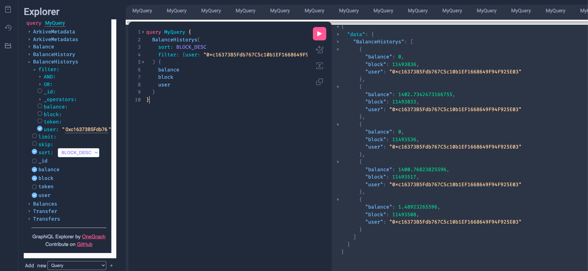

In this example we will look at how to store the token balance history all accounts [Arkiver](https://github.com/RoboVault/robo-arkiver)

## Requirements

- [Deno](https://deno.com/manual@v1.33.1/getting_started/installation)
- [Arkiver CLI](https://robo-arkiver-docs.vercel.app/docs/getting-started/prerequisites#install-arkiver-cli)
- [Docker Compose](https://docs.docker.com/get-docker/) to running the index job locally

## Create an Arkive Job

Let's start by creating an arkiver job with the Arkiver CLI. Run `arkiver init` and specify the erc20-balance-history template. This example indexes the historic balances for FRAX on ethereum mainnet.

```bash
$ arkiver init


  ▄████████    ▄████████    ▄█   ▄█▄  ▄█   ▄█    █▄     ▄████████    ▄████████ 
  ███    ███   ███    ███   ███ ▄███▀ ███  ███    ███   ███    ███   ███    ███ 
  ███    ███   ███    ███   ███▐██▀   ███▌ ███    ███   ███    █▀    ███    ███ 
  ███    ███  ▄███▄▄▄▄██▀  ▄█████▀    ███▌ ███    ███  ▄███▄▄▄      ▄███▄▄▄▄██▀ 
▀███████████ ▀▀███▀▀▀▀▀   ▀▀█████▄    ███▌ ███    ███ ▀▀███▀▀▀     ▀▀███▀▀▀▀▀   
  ███    ███ ▀███████████   ███▐██▄   ███  ███    ███   ███    █▄  ▀███████████ 
  ███    ███   ███    ███   ███ ▀███▄ ███  ███    ███   ███    ███   ███    ███ 
  ███    █▀    ███    ███   ███   ▀█▀ █▀    ▀██████▀    ██████████   ███    ███ 
               ███    ███   ▀                                        ███    ███ 


          -----===== Arkiver v0.4.4 - https://arkiver.net =====-----

 ? Where should we create your arkive? (./cool-new-arkive) › ./erc20_events
 ? Which template would you like to use? (event-wildcard) › erc20-events
 ? Are you using VSCode? (Yes) › Yes
 ✔ Initialized arkive
```

This arkive exmaple is prepared with everything we need.
:::tip Let's take a look inside

Infomation overload? Skip to [Running the arkive](#run-indexing-locally)

### Entities

Entities specify how the indexed data is stored in the db and how it is accessed via the graphql interface. 

We want 3 entities:
- Balance: Latest balance for each address
- BalanceHistory: Track all changes in balances
- Transfer: We're going to listen to the Transfer event, so this one is free.

```ts title="entities.ts"
import { createEntity } from 'https://deno.land/x/robo_arkiver/mod.ts'

// note: "Index: true" enhances graphql queries 
// Contains all transfer events
export const Transfer = createEntity('Transfer', {
	token: String,
	block: { type: Number, index: true }, 
	hash: String,
	from: String,
	to: String,
	value: Number,
})

// Contains current balance for all users
export const Balance = createEntity('Balance', {
	token: String,
	user: String,
	balance: Number,
})

// Contains all balance changes for every user
export const BalanceHistory = createEntity('BalanceHistory', {
	token: String,
	block: { type: Number, index: true },
	user: String,
	balance: Number,
})

export const Entities = [Balance, BalanceHistory, Transfer]
```

### Manifest

The manifest configures the datasources of the index job. We 

```ts title="manifest.ts"
import { Manifest } from 'https://deno.land/x/robo_arkiver/mod.ts'
import erc20 from './erc20.ts'
import { Entities } from './entities.ts'
import { onTransfer } from './handlers.ts'

const manifest = new Manifest('frax-balances')

manifest
	.addEntities(Entities)
	.chain('mainnet', { blockRange: 500n })
	.contract(erc20)
	.addSources({ '0x853d955aCEf822Db058eb8505911ED77F175b99e': 11465581n })
	.addEventHandlers({ 'Transfer': onTransfer })

export default manifest.build()

```

This manifest file configures the arkive job with the following properties:
- Listen to the FRAX token address `0x853...99e`
- Start indexing at block 11465581, which is when the contract was deployed
- Subscribe to the Transfer event
- Include all entities so they're accessible via the graphql server

### Handler

`handler.ts` contains `onTransfer`, which is called for every Transfer event repectively. Let's walk through what's happening in this handler

```ts title="handler.ts"
	// Store the transfer event
	const { from, to, value } = event.args
	const address = event.address

	// Grab the decimals with viem
	// Use store to cache the value so it is only called once
	const decimals = await store.retrieve(`${address}:decimals`, async () => {
		return await client.readContract({ abi: erc20, address, functionName: "decimals" })
	})
```

First of all, we grab the args and token address from the event object. Following that we call FRAX.decimals() to get the decimal places for frax. We could hard-code this, though this means the handler will work with any ERC20 token address. 

Notice the use of `store`, store is a key-value store we're using to cache the decimals so `decimals()` is only called once when the indexing starts.

```ts title="handler.ts"
	const updateBalance = async (user: string, value: number) => {
		// ignore zero address
		if (user === ZERO_ADDRESS)
			return

		// grab the balance entry for the user
		const bal = await getBalance(user, address)

		// adjust the value
		bal.balance += value

		// Create a BalanceHistory entry to record
		// historic changes in the balance
		const entry = new BalanceHistory({
			token: address,
			block,
			user, 
			balance: bal.balance,
		})

		// Save both the balance and the history entry
		return Promise.all([
			bal.save(),
			entry.save()
		])
	}
```

`updateBalance` does the following:
- Ignores zero addresses
- Gets the balance entry for user, and creates a new entry if it's the first time the address received funds. 
- Adjusts the entry's balance by `value`
- Creates a new Entry to snapshot the balance of the user at this block
- Saves both the Balance and BalanceHistory entries

```ts title="handler.ts"
	// Update the balances for both the sender and the receiver
	// note: user await here to ensure the handler is synchonous 
	// 		 so te balances are updated
	const amount = Number(formatUnits(value, Number(decimals)))
	await Promise.all([
		updateBalance(from, -amount),
		updateBalance(to, amount),
	])
```
All that is remaining is calling update balance for the **from** user and **to** user
:::

## Run Indexing Locally

Run the index job locally. This will spin up a database and the graphql server with docker for a fully-feature local dev environment 
> Optional: run `arkiver start --help` to see the options

```bash
$ arkiver start .
```

Desired output: 
```bash
          -----===== Arkiver v0.4.4 - https://arkiver.net =====-----

[0:simple@v1.0] INFO Running Arkive - simple
🚀 Arkiver playground ready at http://0.0.0.0:4000/graphql
[0:simple@v1.0] INFO Running handlers for blocks 4753115-4753616 (500 blocks - 9 items)
[0:simple@v1.0] INFO Processed blocks 4753115-4753616 in 78.758ms (6348.541 blocks/s - 114.274 items/s)
[0:simple@v1.0] INFO Running handlers for blocks 4753616-4754117 (500 blocks - 18 items)
...
```

The index job is running, you can now navigate to http://0.0.0.0:4000/graphql to see the graphql explorer to experiment with the indexed data. 

Note: Make sure you click the explorer icon on the left menu to see what queery options are available.

<!--  -->

## Explore the data

Let's take a look at the data we now have access to with some example queries

### Current Balance for all users, with pagination

```graphql
query MyQuery {
  Balances(skip: 0, limit: 100) {
    token
    user
    balance
  }
}
```

```json title="response"
{
    "Balances": [
      {
        "user": "0x234D953a9404Bf9DbC3b526271d440cD2870bCd2",
        "balance": 4.3655745685100555e-11
      },
      {
        "user": "0x642a101709e48d986844656f6Ec7586bEd71bEdd",
        "balance": 1.0322764865122736e-9
      },
	  ...
	]
}
```

### Current Balance for a user

```graphql
query MyQuery {
  Balances(filter: {user: "0x234D953a9404Bf9DbC3b526271d440cD2870bCd2"}) {
    token
    user
    balance
  }
}
```

```json title="response"
{
  "Balances": [
    {
      "token": "0x853d955acef822db058eb8505911ed77f175b99e",
      "user": "0x234D953a9404Bf9DbC3b526271d440cD2870bCd2",
      "balance": 400
    }
  ]
}
```

### Balance History for a user

```graphql
query MyQuery {
  BalanceHistorys(
    sort: BLOCK_DESC
    filter: {user: "0xc16373B5Fdb767C5c10b1EF1668649F94F925E03"}
  ) {
    balance
    block
  }
}
```

```json title="response"
{
    "BalanceHistorys": [
      {
        "balance": 0,
        "block": 11493836
      },
      {
        "balance": 1402.7342473166755,
        "block": 11493833
      },
	  ...
	]
}
```


## Deploy to Production

To deploy the arkive job to production you must sign in to your arkiver account. Run `arkiver help` for more infomation. 

To deploy, simply run:

```bash
arkiver deploy .
```

This will package an deploy the arkive job. The name of the arkive job is specified in the manifiest file, in this example it's "frax-balances". 

Navigate to `https://data.arkiver.net/$USERNAME/frax-balances/graphql`, where $USERNAME is your username, to see your custom, production-ready graphql endpoint. 

Here is a deployment we prepared perviously:
> https://data.arkiver.net/robolabs/frax-balances/graphql