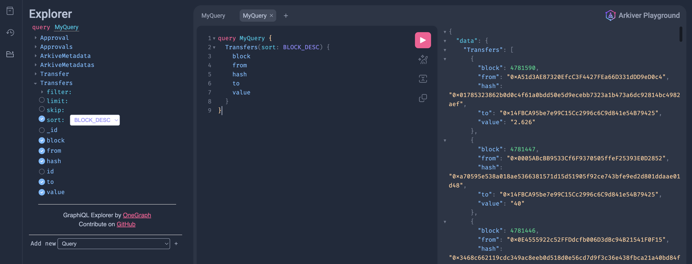

One trivial application of Arkiver is to index all events emitted for a paricular contract. In this example we will look at how to index all events emitted by a contract using [Arkiver](https://github.com/RoboVault/robo-arkiver)

## Requirements

- [Deno](https://deno.com/manual@v1.33.1/getting_started/installation)
- [Arkiver CLI](http://localhost:3000/docs/getting-started/prerequisites#install-arkiver-cli)
- [Docker Compose](https://docs.docker.com/get-docker/) if running the index job locally

## Create an Arkive Job

Let's start by creating an arkiver job with the Arkiver CLI. Run `arkiver init` and specify the erc20-events template.

```bash
$ arkiver init


  ▄████████    ▄████████    ▄█   ▄█▄  ▄█   ▄█    █▄     ▄████████    ▄████████ 
  ███    ███   ███    ███   ███ ▄███▀ ███  ███    ███   ███    ███   ███    ███ 
  ███    ███   ███    ███   ███▐██▀   ███▌ ███    ███   ███    █▀    ███    ███ 
  ███    ███  ▄███▄▄▄▄██▀  ▄█████▀    ███▌ ███    ███  ▄███▄▄▄      ▄███▄▄▄▄██▀ 
▀███████████ ▀▀███▀▀▀▀▀   ▀▀█████▄    ███▌ ███    ███ ▀▀███▀▀▀     ▀▀███▀▀▀▀▀   
  ███    ███ ▀███████████   ███▐██▄   ███  ███    ███   ███    █▄  ▀███████████ 
  ███    ███   ███    ███   ███ ▀███▄ ███  ███    ███   ███    ███   ███    ███ 
  ███    █▀    ███    ███   ███   ▀█▀ █▀    ▀██████▀    ██████████   ███    ███ 
               ███    ███   ▀                                        ███    ███ 


          -----===== Arkiver v0.4.4 - https://arkiver.net =====-----

 ? Where should we create your arkive? (./cool-new-arkive) › ./erc20_events
 ? Which template would you like to use? (event-wildcard) › erc20-events
 ? Are you using VSCode? (Yes) › Yes
 ✔ Initialized arkive
```

This arkive exmaple is prepared with everything we need. Let's take a look inside

## Example: erc20-events
### Entities

Entities specify how the indexed data is stored in the db and how it is accessed via the graphql interface. 

We're going to need an entity for each event on the contract. The ERC20 [Specification](https://eips.ethereum.org/EIPS/eip-20) tells us the ERC20 tokens must emit 2 events. Alternatively you can refer to the contract ABI to see what events are emitted. 

```c++
event Transfer(address indexed from, address indexed to, uint256 value)
event Approval(address indexed owner, address indexed spender, uint256 value)
```

In entites.ts we create an entity for each event, adding block and hash because they are often useful.

```ts title="entities.ts"
import { createEntity } from 'https://deno.land/x/robo_arkiver/mod.ts'

// @note: "Index: true" enhances graphql queries 
export const Transfer = createEntity('Transfer', {
	id: String,
	block: { type: Number, index: true },
	hash: String,
	from: String,
	to: String,
	value: String,
})

export const Approval = createEntity('Approval', {
	id: String,
	block: { type: Number, index: true },
	hash: String,
	owner: String,
	spender: String,
	value: String,
})
```

### Manifest

The manifest configures the datasources of the index job.

```ts title="manifest.ts"
import { Manifest } from 'https://deno.land/x/robo_arkiver/mod.ts'
import erc20 from './erc20.ts'
import { Transfer, Approval } from './entities.ts'
import { onTransfer, onApproval } from './handlers.ts'

const manifest = new Manifest('weth-events')

manifest
	.addEntities([Transfer, Approval]) 
	.chain('mainnet', { blockRange: 500n })
	.contract(erc20)
	.addSources({ '0xC02aaA39b223FE8D0A0e5C4F27eAD9083C756Cc2': 4729568n })
	.addEventHandlers({ 'Transfer': onTransfer })
	.addEventHandlers({ 'Approval': onApproval })

export default manifest.build()
```

This manifest file configures the arkive job with the following properties:
- Creates a datasource for Ethereum that indexes the WETH contract address, and subscribes to Transfer and Approval events.  
- Adds the entities Transfer and Approval, making them accessibly from the graphql endpoint

### Handler

`handler.ts` contains `onTransfer` and `onApproval`, which are called for every Transfer and Approval event repectively. 

Below is a snippet of `handler.ts`, specifically the onTransfer function. The function simply extracts the arguments from the event and stores the Transfer document to the db. 
```ts title="handler.ts"

export const onTransfer: EventHandlerFor<typeof erc20, 'Transfer'> = async ({ event }) => {
	const { from, to, value } = event.args
	const block = Number(event.blockNumber)
	const id = `${event.transactionHash}:${block}:${event.transactionLogIndex}}`
	const record = new Transfer({
		id,
		hash: event.transactionHash,
		block,
		from, 
		to, 
		value: formatUnits(value, TOKEN_DECIMALS),
	})
	record.save()
}
```

## Run Indexing Locally

Run the index job locally:

```bash
$ arkiver start .
```

Desired output: 
```bash
          -----===== Arkiver v0.4.4 - https://arkiver.net =====-----

[0:simple@v1.0] INFO Running Arkive - simple
🚀 Arkiver playground ready at http://0.0.0.0:4000/graphql
[0:simple@v1.0] INFO Running handlers for blocks 4753115-4753616 (500 blocks - 9 items)
[0:simple@v1.0] INFO Processed blocks 4753115-4753616 in 78.758ms (6348.541 blocks/s - 114.274 items/s)
[0:simple@v1.0] INFO Running handlers for blocks 4753616-4754117 (500 blocks - 18 items)
...
```

The index job is running, you can now navigate to http://0.0.0.0:4000/graphql to see the graphql explorer to experiment with the indexed data. 

Note: Make sure you click the explorer icon on the left menu to see what queery options are available.



## Deploy to Production

To deploy the arkive job to production you must sign in to your arkiver account. Run `arkiver help` for more infomation. 

To deploy, simply run:

```bash
arkiver deploy .
```

This will package an deploy the arkive job. The name of the arkive job is specified in the manifiest file, in this example it's "weth-events". 

Navigate to `https://data.arkiver.net/$USERNAME/weth-events/graphql`, where $USERNAME is your username, to see your custom, production-ready graphql endpoint. 